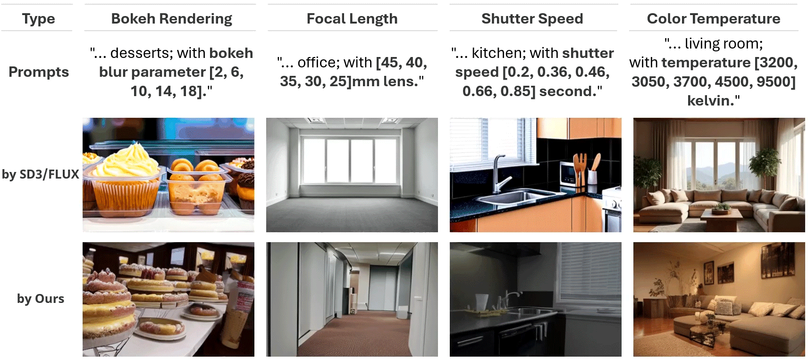

# [CVPR 2025] Generative Photography 

This repository is the official implementation of [Generative Photography](https://arxiv.org/abs/2412.02168).

> **Generative Photography: Scene-Consistent Camera Control for Realistic Text-to-Image Synthesis** <br>
> [Yu Yuan](https://yuanyuspace.cn/about/), [Xijun Wang](https://www.linkedin.com/in/xijun-wang-747475208/), [Yichen Sheng](https://shengcn.github.io/), [Prateek Chennuri](https://www.linkedin.com/in/prateek-chennuri-3a25a8171/), [Xingguang Zhang](https://xg416.github.io/), [Stanley Chan](https://engineering.purdue.edu/ChanGroup/stanleychan.html)<br>

## [[Paper](https://arxiv.org/abs/2412.02168)] [[Project Page](https://generative-photography.github.io/project/)] [[Dataset](https://huggingface.co/datasets/pandaphd/camera_settings)] [[Weights](https://huggingface.co/pandaphd/generative_photography)] [[HF Demo](https://huggingface.co/spaces/pandaphd/generative_photography)]




## 🔥 Latest News!!
* March 4, 2025: Release the Hugging Face Gradio online demo.
* March 3, 2025: Release offical code and pre-trained weights.
* Feb 26, 2025: Paper is accepted by CVPR 2025!
* Dec 20, 2024: Release dataset.

## Todo List
- [x] Release the CVPR camera-ready paper.

## Configurations
### 1. Environment
* CUDA 12.1, 64-bit Python 3.10 and PyTorch 2.1.1
* Other environments may also work, at least for PyTorch 1.13.1 and CUDA 11.7
* Users can use the following commands to install the packages
```bash
conda env create -f environment.yaml
conda activate genphoto
```

### 2. Prepare Models and Weights
* Download Stable Diffusion V1.5 (SD1.5) from [Hugging Face](https://huggingface.co/Jiali/stable-diffusion-1.5/tree/main)
* Download folder `unet_merged` from [Hugging Face](https://huggingface.co/pandaphd/generative_photography)/unet_merged
or [baiduNetdisk](https://pan.baidu.com/s/1WEnw8c3KcYrW4X8-WSl-Zg?pwd=6666), then move the folder into Stable Diffusion V1.5 (SD1.5)
* Download our pre-trained weights from [Hugging Face](https://huggingface.co/pandaphd/generative_photography)/weights or [baiduNetdisk](https://pan.baidu.com/s/1jmWYSDcKzsQKbtoxG1IdSQ?pwd=6666)


### 3. Modify the File Configuration
* Modify the configuration yaml files in `config` folders, replace all the dataset & ckpt roots with yours


* Replace the `sys.path.append` line in `genphoto/data/dataset.py` with your own BokehMe folder path
```python
sys.path.append('/your_path/genphoto/data/BokehMe/')
```


* Replace all instances of `self.CLIPTokenizer` and `self.CLIPTextModel` in `genphoto/data/dataset.py` with your own Stable Diffusion v1.5 path
Replace all instances of `CLIPTokenizer` and `CLIPTextModel` in `genphoto/data/dataset.py` with your own Stable Diffusion v1.5 path:
```python
self.tokenizer = CLIPTokenizer.from_pretrained("/your_path/stable-diffusion-v1-5/", subfolder="tokenizer")
self.text_encoder = CLIPTextModel.from_pretrained("/your_path/stable-diffusion-v1-5/", subfolder="text_encoder")
```


## Inference

```python 
# For bokeh rendering
python inference_bokehK.py --config configs/inference_genphoto/adv3_256_384_genphoto_relora_bokehK.yaml --base_scene "A young boy wearing an orange jacket is standing on a crosswalk, waiting to cross the street." --bokehK_list "[2.44, 8.3, 10.1, 17.2, 24.0]"

# For focal length
python inference_focal_length.py --config configs/inference_genphoto/adv3_256_384_genphoto_relora_focal_length.yaml --base_scene "A cozy living room with a large, comfy sofa and a coffee table." --focal_length_list "[25.0, 35.0, 45.0, 55.0, 65.0]"

# For shutter speed
python inference_shutter_speed.py --config configs/inference_genphoto/adv3_256_384_genphoto_relora_shutter_speed.yaml --base_scene "A modern bathroom with a mirror and soft lighting." --shutter_speed_list "[0.1, 0.3, 0.52, 0.7, 0.8]"

# For color temperature 
python inference_bokehK.py --config configs/inference_genphoto/adv3_256_384_genphoto_relora_bokehK.yaml --base_scene "A young boy wearing an orange jacket is standing on a crosswalk, waiting to cross the street." --bokehK_list "[2.44, 8.3, 10.1, 17.2, 24.0]"
```

## Training
### 1. Prepare Dataset
* Download the training and validation camera setting dataset (base images for each camera setting) from [Hugging Face](https://huggingface.co/datasets/pandaphd/camera_settings). 
We do the physical simulation on-the-fly in `genphoto/data/dataset.py`


* [optional] Using [LLaVA](https://github.com/haotian-liu/LLaVA) or other vision language models to generate a caption for each base image. We already provide our extracted captions in the `annotations/xxxx.json` files


### 2. Modify the Training Configuration
* Modify the training hyperparameter in the training yaml files located in `configs/train_genphoto`,
you can resume the training from our provided weights


### 3. Training Examples

```python 
# example for training bokeh rendering
python -m torch.distributed.launch --nproc_per_node=1 --use_env train_bokehK.py --config configs/train_genphoto/adv3_256_384_genphoto_relora_bokehK.yaml
```

## Evaluation

We provide the evaluation metrics code in `comp_metrics/` folder


## Some Future Directions for Generative Photography

* Support Complex Camera Settings: Currently we only support single camera setting control during generation.
It is theoretically feasible to simultaneously embed complex camera settings in a
 high-dimensional encoding form. It takes some engineer
ing efforts on the realistic data simulation pipeline as it
 requires a long and dedicated sequence of the real-world
 simulation, such as performing optical simulation (focal
 length and aperture) first, followed by CMOS simulation
 (exposure time and color temperature).


* Support Camera Refocused Disparity Bokeh Rendering: The current
bokeh rendering only supports rendering with the bokeh 
blur parameter, with the refocused disparity fixed at 0.96
for all scenes. Dynamic refocused disparity requires the
generative model to have a better understanding of scene depth.


* Wider Camera Setting Spectrum: Currently, due to data rendering and other factors, the supported focal
length range is 24-70mm. There is a demand for a wider spectrum.


* Minimize the Simulation Bias: Simple physics-based rendering is reliable but also introduces certain biases that are inconsistent 
with the real world, such as the lack of true optical distortions.


* Adapt to the DiT Architecture and Larger Resolution: For better quality.


## Disclaimer
This project is released for academic use. We disclaim responsibility for user-generated content. Users are solely liable for their actions. The project contributors are not legally affiliated with, nor accountable for, users' behaviors. Use the generative model responsibly, adhering to ethical and legal standards. 


## Acknowledgement
We thank [AnimateDiff](https://github.com/guoyww/AnimateDiff) and [CameraCtrl](https://github.com/hehao13/CameraCtrl) for their amazing jobs.


## BibTeX

```bibtex
@article{Yuan_2024_GenPhoto,
  title={Generative Photography: Scene-Consistent Camera Control for Realistic Text-to-Image Synthesis},
  author={Yuan, Yu and Wang, Xijun and Sheng, Yichen and Chennuri, Prateek and Zhang, Xingguang and Chan, Stanley},
  journal={CVPR},
  year={2025}
}
```