# Generative Photography

This repository is the official implementation of [Generative Photography](https://arxiv.org/abs/2412.02168).

> **Generative Photography: Scene-Consistent Camera Control for Realistic Text-to-Image Synthesis** <br>
> [Yu Yuan](https://yuanyuspace.cn/about/), [Xijun Wang](https://www.linkedin.com/in/xijun-wang-747475208/), [Yichen Sheng](https://shengcn.github.io/), [Prateek Chennuri](https://www.linkedin.com/in/prateek-chennuri-3a25a8171/), [Xingguang Zhang](https://xg416.github.io/), [Stanley Chan](https://engineering.purdue.edu/ChanGroup/stanleychan.html)<br>

## [[Paper](https://arxiv.org/abs/2412.02168)] [[Project Page](https://generative-photography.github.io/project/)] [[Dataset](https://huggingface.co/datasets/pandaphd/camera_settings)] [[Weights(coming)](https://huggingface.co/)] [[HF Demo(coming)]()]


## Abstract

Image generation today can produce somewhat realistic images from text prompts. However, if one asks the generator to synthesize a particular camera setting such as creating different fields of view using a 24mm lens versus a 70mm lens, the generator will not be able to interpret and generate scene-consistent images. This limitation not only hinders the adoption of generative tools in photography applications but also exemplifies a broader issue of bridging the gap between the data-driven models and the physical world. In this paper, we introduce the concept of **Generative Photography**, a framework designed to control **camera intrinsic settings** during content generation. The core innovation of this work are the concepts of **Dimensionality Lifting and Contrastive Camera Learning**, which achieve continuous and consistent transitions for different camera settings. Experimental results show that our method produces significantly more scene-consistent photorealistic images than state-of-the-art models such as Stable Diffusion 3 and FLUX.

## Motivation

Current state-of-the-art text-to-image generation models like [Stable Diffusion 3 (SD3)](https://huggingface.co/stabilityai/stable-diffusion-3-medium) and [FLUX](https://github.com/black-forest-labs/flux) face two major limitations: the inability to accurately **interpret** camera-specific settings and the challenge of maintaining **consistency** in the base scene (pls see below examples).

This work introduces a novel approach that addresses these issues, enabling precise camera setting control and consistent scenes in generative models.

| **Type**             | **Bokeh Rendering**                                                   | **Focal Length**                                        | **Shutter Speed**                                        | **Color Temperature**                                      |
|----------------------|-----------------------------------------------------------------------|--------------------------------------------------------|----------------------------------------------------------|------------------------------------------------------------|
| **Prompts**          | "... desserts; with **bokeh blur parameter [2, 6, 10, 14, 18].**"     | "... office; with **[45, 40, 35, 30, 25]mm lens.**"     | "... kitchen; with **shutter speed [0.2, 0.36, 0.46, 0.66, 0.85] second.**" | "... living room; with **temperature [3200, 3050, 3700, 4500, 9500] kelvin.**" |
| **Generated by SD3/FLUX** |  | 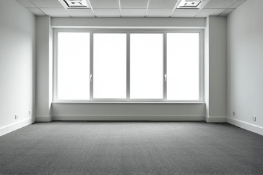    | 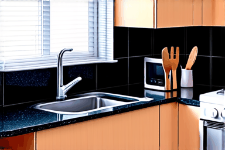    | 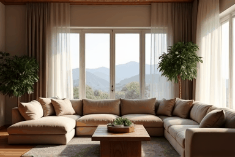  |
| **Ours**              | 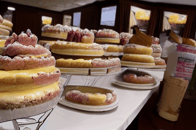             | 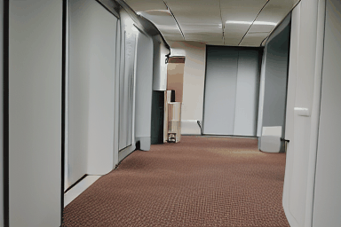    | 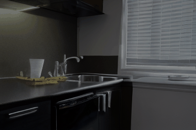   | 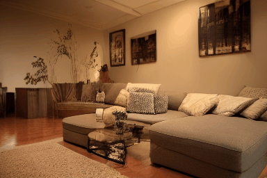  |


## Todo List
- [x] Release network and training code.
- [x] Release pretrained weights.
- [x] Release physical camera settings simulation code.
- [x] Release Gradio Demo.
- [x] Release pretrained models on other T2V foundation models.

## Configurations
### Environment
* 64-bit Python 3.10 and PyTorch 1.13.1.
* CUDA 11.7 
* Users can use the following commands to install the packages
```bash
conda env create -f environment.yaml
conda activate genphoto
```

### Dataset
- Download the camera setting dataset (base images for each camera setting) from [camera_settings](https://huggingface.co/datasets/pandaphd/camera_settings).
- Using [LLaVA](https://github.com/haotian-liu/LLaVA) or other vision language models to generate a caption for each base image. We already provide our extracted captions in the `annotations/xxxx_json.py` folders.
- You can split the json files for training and testing, you can construct the validation json file by randomly sampling some item from the training json file. 
- All camera setting physical simulations will be done before dataloader.


## Inference


## Training


## Gallery

We showcase visual results generated by different methods on camera bokeh rendering, focal length, shutter speed, and color temperature control. Both [Stable Diffusion 3 (SD3)](https://huggingface.co/stabilityai/stable-diffusion-3-medium) and [FLUX](https://github.com/black-forest-labs/flux) generate images with a fixed random seed.

Both [AnimateDiff](https://animatediff.github.io/) and [CameraCtrl](https://hehao13.github.io/projects-CameraCtrl/) have been fine-tuned/trained on our contrastive data.

| Type                | Bokeh Rendering | Focal Length  | Shutter Speed | Color Temperature |
|---------------------|-----------------|---------------|---------------|-------------------|
| **Prompts**          | "A horse with a white face stands in a grassy field, looking at the camera; with **bokeh blur parameter [28.0, 14.0, 10.0, 6.0, 2.0].**" | "A beautiful garden filled with red roses and green leaves; with **[24.9, 36.9, 48.9, 60.9, 69.9]mm lens.**" | "A blue pot with a plant in it is placed on a window sill, surrounded by other potted plants; with **shutter speed [0.88, 0.68, 0.48, 0.38, 0.28] second.**" | "A collection of trash cans and a potted plant are seen in the image. The trash cans are individually in blue, black, and yellow; with **temperature [3100.0, 4000.0, 8000.0, 7000.0, 3000.0] kelvin.**" |
| **SD3**             | 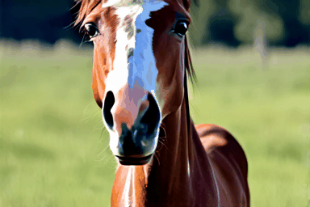 | 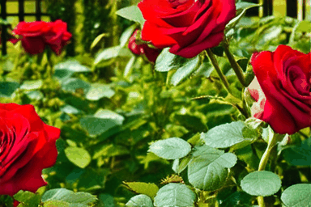 |  |  |
| **FLUX**            | 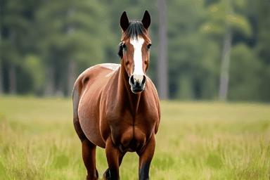 | 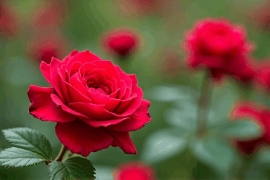 | 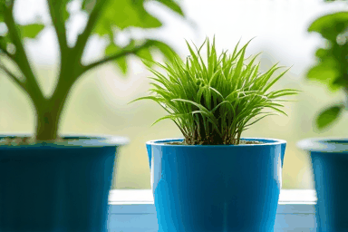 | 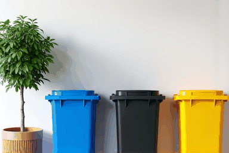 |
| **AnimateDiff**     | 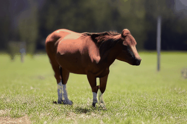 | 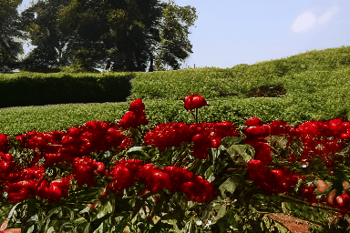 | 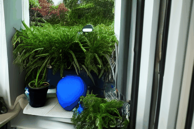 | 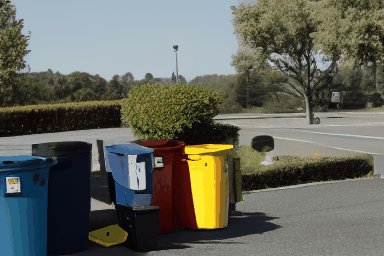 |
| **CameraCtrl**      | 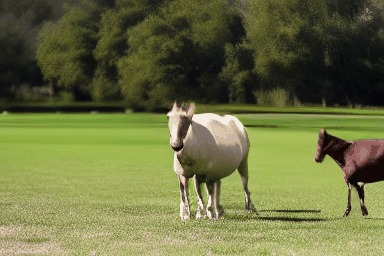 | 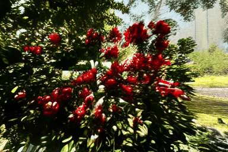 | 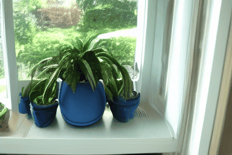 | 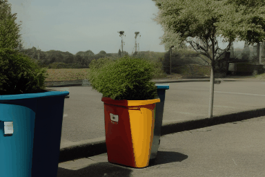 |
| **Ours**            | 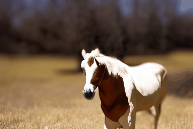 | 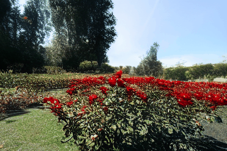 | 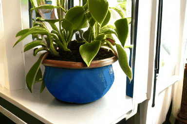 | 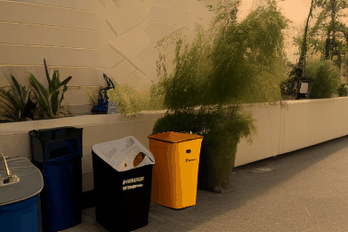 |

We show more camera-controlled videos generated by our method.

| Bokeh Rendering |  |  |  |
|-----------------|--|--|--|
| **Prompts**     | "A single pink rose stands out in a field of green grass; with **bokeh blur parameter [17.0, 14.0, 11.0, 8.0, 3.0].**" | "A variety of potted plants are displayed on a window sill, with some of them placed in yellow and white cups; with **bokeh blur parameter [18.0, 14.0, 10.0, 6.0, 2.0].**" | "A colorful backpack with a floral pattern is sitting on a table next to a computer monitor; with **bokeh blur parameter [2.0, 8.0, 13.0, 20.0, 29.0].**" |
| **Ours**        |  | 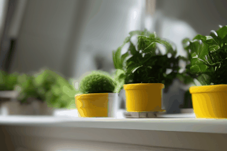 | 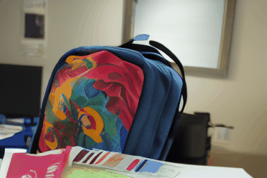 |

| Focal Length    |  |  |  |
|-----------------|--|--|--|
| **Prompts**     | "A clean beach with waves and a few footprints; with **[31.0, 36.0, 42.0, 48.0, 54.0]mm lens.**" | "A quiet mountain trail with rocks and pine trees lining the path; with **[25.0, 33.0, 44.0, 58.0, 68.0]mm lens.**" | "A peaceful lake surrounded by tall grass and small rocks; with **[30.0, 35.0, 45.0, 60.0, 70.0]mm lens.**" |
| **Ours**        | 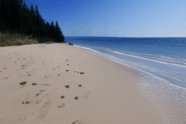 | 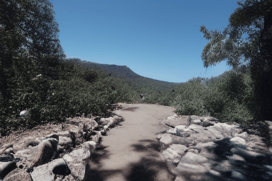 | 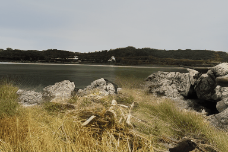 |

| Shutter Speed   |  |  |  |
|-----------------|--|--|--|
| **Prompts**     | "A cozy living room with a large, comfy sofa and a coffee table; with **shutter speed [0.2, 0.3, 0.4, 0.5, 0.6] second.**" | "A group of horses graze on a grassy field near a lake; with **shutter speed [0.77, 0.64, 0.43, 0.29, 0.19] second.**" | "A spacious dining room with a wooden table and chairs around it; with **shutter speed [0.89, 0.64, 0.49, 0.29, 0.19] second.**" |
| **Ours**        | 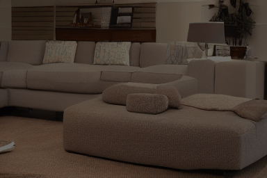 | 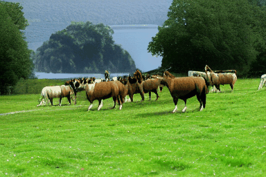 | 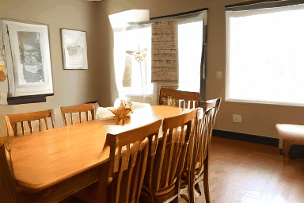 |

| Color Temp.     |  |  |  |
|-----------------|--|--|--|
| **Prompts**     | "The image depicts a large conference room with a long table surrounded by numerous chairs; with **temperature [8000.0, 6000.0, 4000.0, 3000.0, 2000.0] kelvin.**" | "A view of a house surrounded by trees, with a green lawn in front of it; with **temperature [3600.0, 2600.0, 4600.0, 5600.0, 6600.0] kelvin.**" | "A beautiful view of a city with a castle and a large body of water; with **temperature [3000.0, 6000.0, 7000.0, 8000.0, 9000.0] kelvin.**" |
| **Ours**        |  | 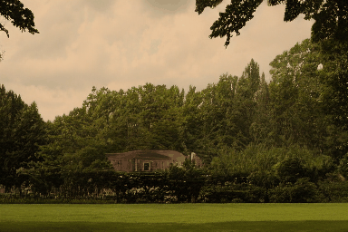 | 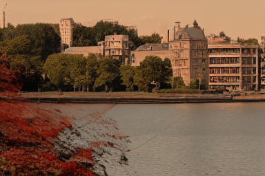 |


## Disclaimer
This project is released for academic use. We disclaim responsibility for user-generated content. Users are solely liable for their actions. The project contributors are not legally affiliated with, nor accountable for, users' behaviors. Use the generative model responsibly, adhering to ethical and legal standards. 


## Acknowledgement
We thank [AnimateDiff](https://github.com/guoyww/AnimateDiff) and [CameraCtrl](https://github.com/hehao13/CameraCtrl) for their amazing jobs.


## BibTeX

```bibtex
@article{Yuan_2024_GenPhoto,
  title={Generative Photography: Scene-Consistent Camera Control for Realistic Text-to-Image Synthesis},
  author={Yuan, Yu and Wang, Xijun and Sheng, Yichen and Chennuri, Prateek and Zhang, Xingguang and Chan, Stanley},
  journal={arXiv preprint arXiv: 2412.02168},
  year={2024}
}
```